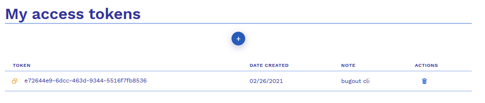
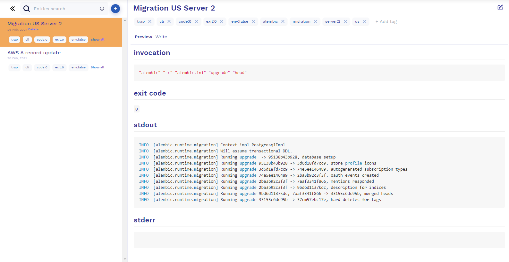
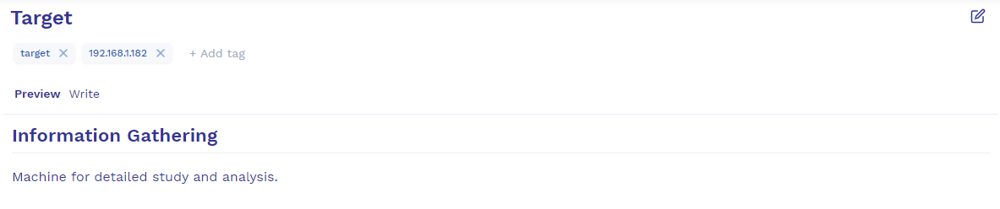
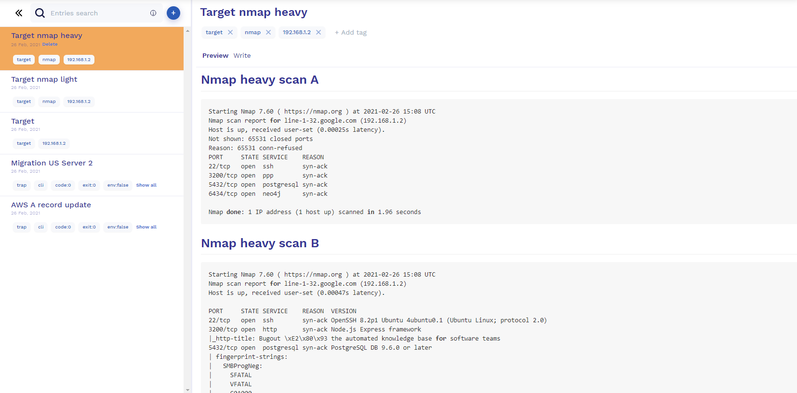

# Bugout CLI


## Installation

You can download the latest version of Bugout CLI on [release page](https://github.com/bugout-dev/bugout-go/releases). The installation process described below will be done on Ubuntu 18.04.

```bash
sudo mkdir /opt/bugout
sudo wget https://github.com/bugout-dev/bugout-go/releases/download/v0.3.1/bugout-linux-amd64.zip -P /opt/bugout
sudo unzip -j bugout-linux-amd64.zip -d /opt/bugout
```

Add a symlink for quick access to the Bugout CLI:

```bash
sudo ln -s /opt/bugout/bugout /usr/bin/bugout
```

Once you have an [Bugout account](https://bugout.dev/account) and generated an access token, if you would like Bugout CLI to use it automatically without having to explicitly pass it using `-t`/`--token` every time, you can set it as the `BUGOUT_ACCESS_TOKEN` and `BUGOUT_JOURNAL_ID` environment variable.



To get the ID of the journal, you need to create a new journal in the [Bugout web interface](https://bugout.dev/journals/) or use existing, go to it and copy the uuid from the url:
`https://bugout.dev/journals/57125fa9-6ba5-4bb2-9fc2-d1e27b18e4a2`.

```bash
export BUGOUT_ACCESS_TOKEN="e72644e9-6dcc-463d-9344-5516f7fb8536"
export BUGOUT_JOURNAL_ID="57125fa9-6ba5-4bb2-9fc2-d1e27b18e4a2"
```

## Use Cases

### Bugout trap

Let's assume that we need to migrate the database on our production server. Since this is a very important and responsible procedure, we would like to keep logs for documentation and future analysis.

Using command `bugout trap` with proper title and tags we will redirect stdout and stderr to our personal/group journal, which are available for all engineers you wanted to.

```bash
bugout trap --title="Migration US Server 2" --tags="alembic,migration,server:2,us" -- alembic -c alembic.ini upgrade head
```

In your [Bugout journal](https://bugout.dev/journals/) you can find report from this command:




### Bugout in bash

Another useful function when you need to execute several commands in turn and it takes a certain amount of time. 
Let's write a small script that retrieves data from a prepared template and fill journals with detailed entries.

We have an entry https://bugout.dev/57125fa9-6ba5-4bb2-9fc2-d1e27b18e4a2/c9b95a83-05e0-4fb9-9403-6ab80ad07c98 where entry ID is `c9b95a83-05e0-4fb9-9403-6ab80ad07c98` with IP in tags and some description:



Prepare bash script, [full version of nmap-target.sh here](./scripts/nmap-target.sh)

Import and process data about target from our previously created entry:
```bash
#!/usr/bin/env bash
...
# Import and process data about target
target_entry=$(bugout entries get -i $target_entry_id)
target_entry_title_raw=$(echo "$target_entry" | jq ".title")
target_entry_tags_raw=$(echo "$target_entry" | jq ".tags[]")
# Extract only IP from tags
target_ip_raw=$(echo "$target_entry_tags_raw" | awk '/[0-9]+\.[0-9]+\.[0-9]+\.[0-9]+/{print $0}')
...
```

Publish new entry with light scan results:
```bash
...
# Start light nmap scan
nmap_scan_light=$(nmap $target_ip $light_scan_flags)
nmap_scan_light_content="
# Nmap light scan result
\`\`\`bash
$nmap_scan_light
\`\`\`
"
bugout entries create --title "$target_entry_title nmap light" --tags "$target_entry_tags_comma,nmap" --content "$nmap_scan_light_content"
...
```

Update previously extracted entry:
```bash
...
# Update main target entry
target_entry_content_updated="
$target_entry_content

### Available ports
$nmap_scan_a_ports
"
bugout entries update --id "$target_entry_id" --title "$target_entry_title" --content "$target_entry_content_updated"
...
```

Another steps is same and can be modified for any purpose. Run our script where first argument is entry ID:
```bash
./nmap-target.sh c9b95a83-05e0-4fb9-9403-6ab80ad07c98
```

Eventually, records will appear in our journal with the results of the completed steps of the script. 


