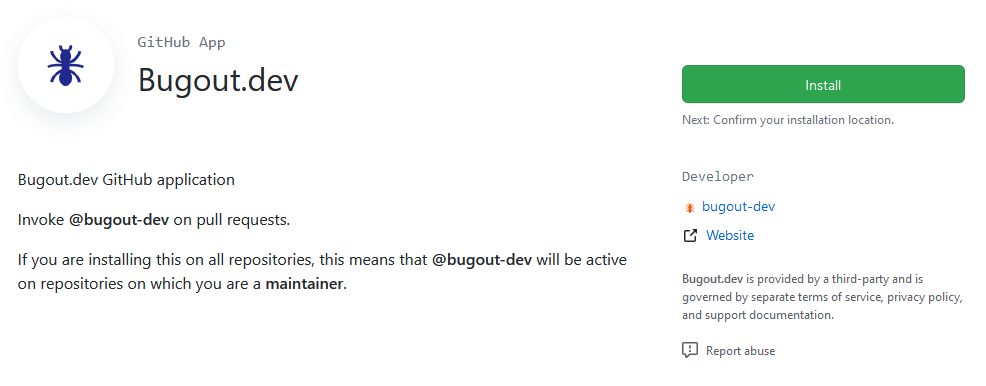
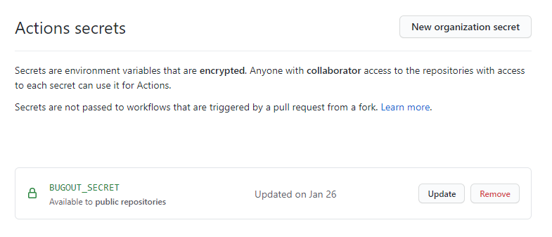
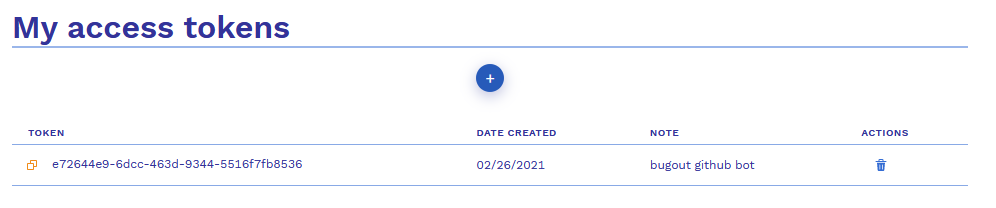
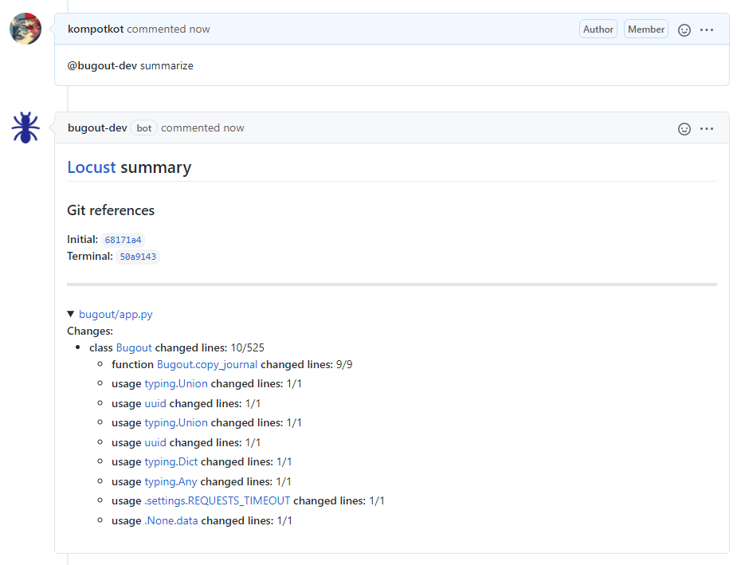
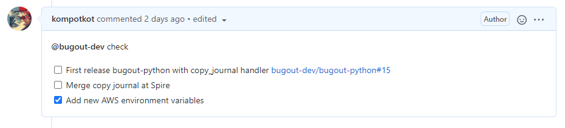
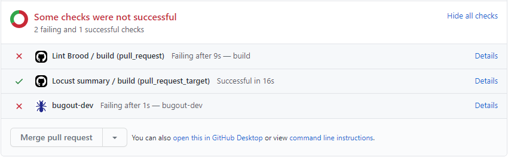

# Bugout GitHub bot


## Installation

You can find our Bot [bugout-dev](https://github.com/apps/bugout-dev) in GitHub marketplace. Press Install and choose your Organization or your personal account.



Bugout bot requires:
- Read access to actions, code, commit statuses, metadata, and repository hooks
- Read and Write access to checks, issues, and pull requests

After installation, only the functionality of **Checks** will be available, in order to be able to access the **Summaries** you need to synchronize the Bugout account with the installed bot.

If you already have a [Bugout account](https://bugout.dev/account), add new Secret **BUGOUT_SECRET** in organization/repository secrets. 



The value (token) you can get from your [Bugout account token page](https://bugout.dev/account/tokens)



Now you will see GitHub journal appears in you [Bugout journal](https://bugout.dev/journals) list. In order to get data from Pull Requests and Issues of a specific repository into it, you need to add `.github/workflow/locust.yml` file in **main** branch.

```yaml
name: Locust summary
on: [pull_request_target]
jobs:
  build:
    runs-on: ubuntu-20.04
    steps:
      - name: PR head repo
        id: head_repo_name
        run: |
          HEAD_REPO_NAME=$(jq -r '.pull_request.head.repo.full_name' "$GITHUB_EVENT_PATH")
          echo "PR head repo: $HEAD_REPO_NAME"
          echo "::set-output name=repo::$HEAD_REPO_NAME"
      - name: Checkout git repo
        uses: actions/checkout@v2
        with:
          repository: ${{ steps.head_repo_name.outputs.repo }}
          fetch-depth: 0
      - name: Install python
        uses: actions/setup-python@v2
        with:
          python-version: "3.8"
      - name: Install dependencies
        run: |
          python -m pip install --upgrade pip setuptools
          pip install bugout-locust
      - name: Generate and send Locust summary
        env:
          BUGOUT_SECRET: ${{ secrets.BUGOUT_SECRET }}
        run: |
          locust.github publish
```

Detailed information about locust and how he analyze your code, you can find in [Locust repository](https://github.com/bugout-dev/locust).

After completing all the steps, you will be able to see an organized entry with description, commits, comments and a short summary of the changes inside the code for each Pull Request or Issue thread in [Bugout journal for your GitHub](https://bugout.dev/journals).

## Use Cases

At the moment, two commands are available for the Bugout GitHub bot:
- Summaries
- Checks

### Summaries

Locust provides a semantic layer on top of git diff. It emits metadata describing AST-level changes to your code base between git revisions.

If you want to receive summary about your code, use command in Pull Request comments:
```
@bugout-dev summarize
```



### Checks

Sometimes, you need human oversight on your pull requests before you can merge them.

This is especially true for Pull Requests that change database schema, introduce new environment variables, or introduce changes with security or legal implications.

To add a check, type:
```
@bugout-dev check
- [ ] Alembic merge heads (if necessary)
- [ ] Run production database migration
```

While you not marked all check as Done, you want be able to merge comments (unless of course you apply administrator privileges).



In checks status bugout-dev will block from careless merging to **main** branch.



On the **Details** page, as well as in the Bugout journal entry for this Pull Request, a brief summary of the status of checks and who approved / created them will be available.

Additional commands to manually accept check:
```
@bugout-dev check accept Run production database migration
```

And commands to manually mark check as undone:
```
@bugout-dev check require Run production database migration
```
